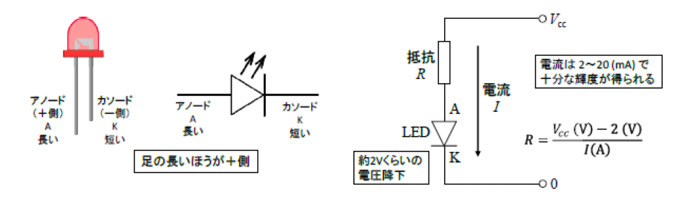
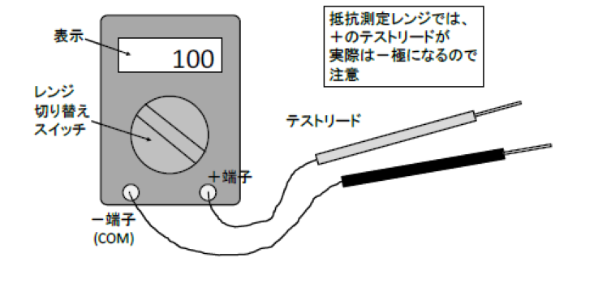
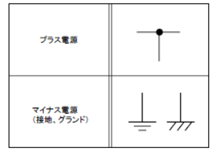
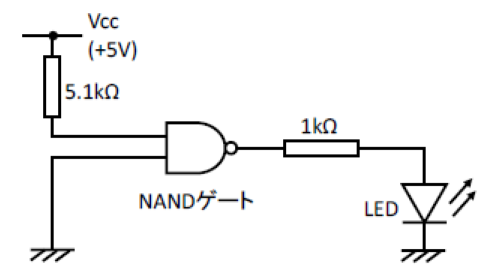
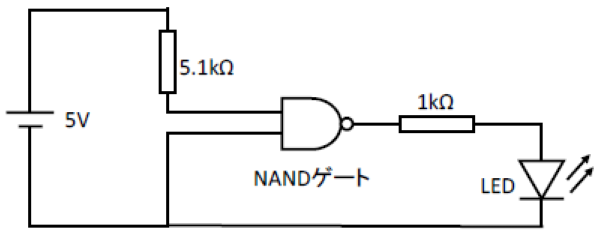
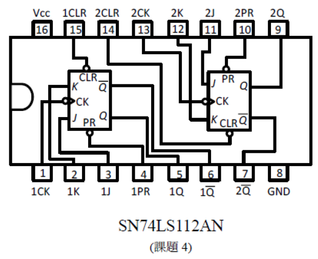
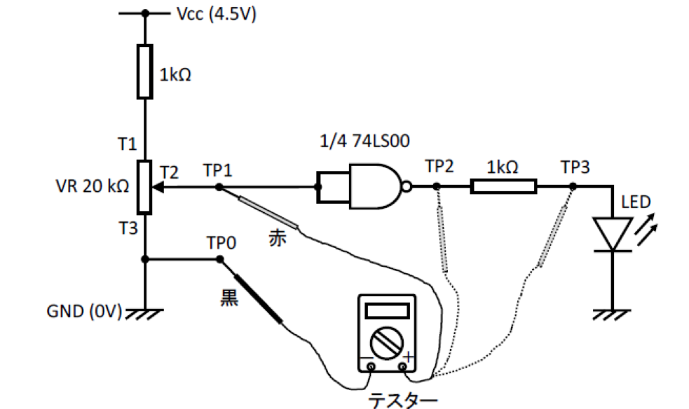
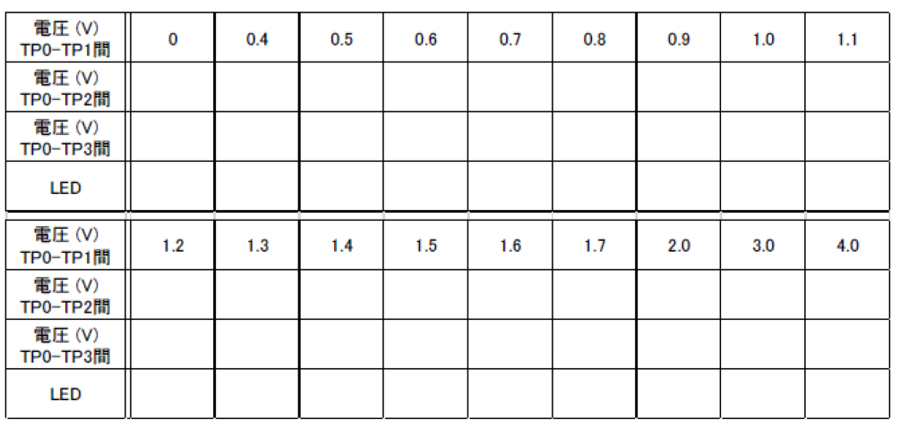
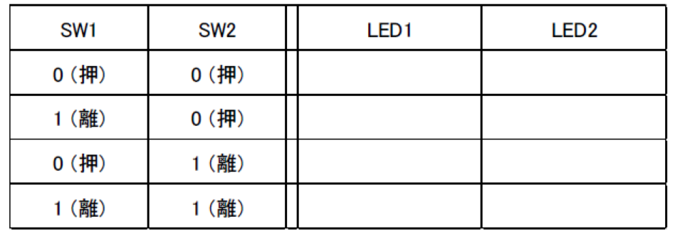

# ディジタル電子回路作製マニュアル

- [ディジタル電子回路作製マニュアル](#ディジタル電子回路作製マニュアル)
  - [抵抗器の抵抗値表示方法](#抵抗器の抵抗値表示方法)
    - [カラーコードによる表示](#カラーコードによる表示)
  - [はんだ付けの方法](#はんだ付けの方法)
  - [LED(発光ダイオード)の使い方](#led発光ダイオードの使い方)
  - [テスターの使い方](#テスターの使い方)
  - [回路図の見方](#回路図の見方)
    - [電源に関する記号](#電源に関する記号)
    - [回路の交差に関する記号](#回路の交差に関する記号)
  - [TTL IC データシート](#ttl-ic-データシート)
  - [実習で使用するICのピン配列](#実習で使用するicのピン配列)
    - [SN74LS00N](#sn74ls00n)
    - [SN74LS112AN](#sn74ls112an)
  - [ディジタル回路演習課題](#ディジタル回路演習課題)
    - [課題1:アナログ・ディジタルの違い](#課題1アナログディジタルの違い)
      - [実験回路](#実験回路)
      - [実験手順](#実験手順)
      - [実配線図](#実配線図)
      - [実験結果記録](#実験結果記録)
    - [課題2:組み合わせ回路(1)](#課題2組み合わせ回路1)
      - [実験回路](#実験回路-1)
      - [実験手順](#実験手順-1)
    - [課題3:組み合わせ回路(2)](#課題3組み合わせ回路2)
      - [実験回路](#実験回路-2)
      - [実験手順](#実験手順-2)
    - [課題4:順序回路(カウンタ回路)](#課題4順序回路カウンタ回路)
      - [実験回路](#実験回路-3)
      - [実験手順](#実験手順-3)

## 抵抗器の抵抗値表示方法

### カラーコードによる表示

小型固定抵抗器では、本体に文字記号を印刷するのが難しいので、4色表示(下の図と表)または5色表示(高精度抵抗)のカラーコードが使われます。

## はんだ付けの方法

はんだごてのこて先はかなり熱くなりますので(200～250℃ぐらい)、手にやけどをしたりしないように注意しましょう。また半導体部品も人間の手と同様弱いものですから、熱しすぎに注意しましょう。はんだ付けのコツをまとめておきます。

1) こて先を過熱させない

これは絶対条件です。こて先に、すっとはんだが熔けてのる程度の温度が理想的です。こて先は酸化して真っ黒け、はんだがころころと玉になって落ちる、というようでは絶望的です。万一そうなったら、温度を下げ、こて先を磨きます。耐熱スポンジで常にこすり、清潔に保つのが効果的です。

2) 接続部をきれいに保つ

はんだの芯に詰めてある脂(フラックス)は、接続部の表面を清浄して、はんだと接続部表面が分子レベルで融合するのを助ける働きをします。ですから、ここに最初から大きなゴミやさびがあったのでは、はんだは付きません。

3) はんだとこて先を同時に当てで2～3秒

はんだと清潔なこて先を同時に接続部に押し当て、“シュッ”、と煙がほんの少し上がり、熔けて盛り上がったはんだが、すっとしみ込むように接続部に行き渡るまでこて先を動かしてはいけません。この間、2～3秒。うまく仕上がれば、はんだの表面は青灰色にきれいに光ります。

## LED(発光ダイオード)の使い方

LEDを点灯するには、アノード (A : 足の長い方)からカソード (K : 足の短い方)に向けて電流を流してやります。LEDが赤色LEDの場合、電圧降下は約2Vと一定です。

## テスターの使い方

電圧、電流、抵抗の測定に用います。それぞれ測定レンジを合わせて測定します。

## 回路図の見方

### 電源に関する記号

＜使用例＞

この回路は次の回路と等価である。

### 回路の交差に関する記号

## TTL IC データシート

市販されているICのピン配列や仕様などがまとめられたものをデータシートといいます。データシートは各メーカーから発行されており、インターネットでダウンロードすることができます。以下データシートに記載されているいくつかの項目について説明します。

データシートの例

1) 型番
TTL IC の型番は以下のように表示されます。

実際のICには、 7 4と0 0の間にそのICの特性や製造方法の違いを示す記号が挿入されます。

> 例: 7 4 L S 0 0

その記号には、次のようなものがあります。

F: Fastの略

S: Schottkyの略

LS: Low power Schottkyの略

ALS: Advanced Low power Schottkyの略

HC: High speed C-MOSの略
4

1) 名称の表示

データシートには、ICの名称が表示されています。
例えば、前ページの例では

> Quad 2 Input NAND

となっています。これは、1個のICに2入力タイプのNANDゲートが4個(Quad)内蔵されていることを示しています。その他の名称についてはデータシートを参照してください。

3) ピン配列

みなさんが最もよく利用するのは、このピン配列表示です。ICには複数のピン(接続端子)が生えていて、それぞれのピンが別々の意味を持っています。このピンの接続を間違えると、回路が正しく動作しないだけでなく、ICを破壊してしまう可能性もあります。ICを使用する場合は、このピン配列をしっかりと確認し、正しく配線を行うことが重要です。
下図は、7400のピン配列を表示しています。これを例にとってピン配列の見方を説明しましょう。

左側のくびれている側が、1番ピンのある方向を示します。くびれを左側にしたときに下側の一番左のピンが1番で、そこから右へ向かって2、3・・・と番号が増加し、下側の一番右まで行くと真上に上がって左向きに番号をつける決まりになっています。それぞれのピンにつけられている記号は次のような意味をもちます。

Vcc、GND: それぞれ+5V、0Vの電源を接続する。これらのピンに接続する配線は、実際の回路図には記入されていないので注意。
1A、1B : ICの中のゲートへの入力ピンを示す。最初の数字はケートの番号を示し、2文宇目のアルファベットは入力ピンの名前を示す。7400では4個のゲートがそれぞれ二つの入力ピンを持つので、1文字目は1～4、2文字目はA、Bのどちらかとなる。
1Y : ゲートの出力ピンを示す。入力ピンと同様に1文字目はゲート番号。2文字目が出力であることを示す。7400では出力としてYを用いる。フリップフロップなどは、 Qを出力ピン記号とする。

1) 等価回路

それぞれのケートは、トランジスタの組み合わせで構成されています。回路を設計する場合によっては、ゲートの内部がどのような回路構成になっているか知る必要がある。そういうときに等価回路図を利用します。みなさんにはまだあまり重要ではありません。

5) 電気的特性・絶対最大定格

電気回路を構成する部品には、それぞれの部品ごとに電気的な特性があります。例えば、電源電圧が何ボルトで何アンペアの電流を消費するのかとか、信号が入力されてから出力が発生するまでにどの程度の時間的な遅れが生じるのかということがそれにあたります。また、電子部品には絶対最大定格と呼ばれる取り決めがあります。これは、部品の使用条件を意味していて、この最大定格を越えた使い方をすると部品の動作を保証しない、あるいは故障する可能性があることを意味しています。特に電源電圧は、厳密に守らないといけません。今の段階ではみなさんはこれらを気にする必要はありません。

## 実習で使用するICのピン配列

### SN74LS00N

### SN74LS112AN

## ディジタル回路演習課題

### 課題1:アナログ・ディジタルの違い

NAND回路を用いてアナログとディジタルの違いを理解する。

#### 実験回路

#### 実験手順

0. 各部品の特性を調査(テスター使用)
1. 回路図をもとに回路を作成
2. テスターの同通チェックを使って配線チェック。配線のチェックには、上の回路図か、次ページの実配線図を用いる。ひとつの銅線部分の接続が終わったら、テスターの抵抗レンジで導通を確認する。確認できたら赤ペンなどでその配線にチェックをつける。この作業を繰り返して全ての銅線がチェックきれれば配線は修了。
3. 端子TP0 (GND) - TP1間にテスターを電圧レンジにしてつなぐ。
4. 可変抵抗を変化させ、テスターの指示電圧とLEDの点灯状態を観測する。また、この時に端子TP0(GND) - TP2、TP0 (GND) - TP3間の電圧も観測する。LEDの点灯状態が反転する電圧を測定する。

#### 実配線図

#### 実験結果記録

可変抵抗を変化きせたときのテスターで測定した各端子間の電圧とLEDの点灯状態を記録せよ。

### 課題2:組み合わせ回路(1)

NAND回路を用いてXOR(排他的論理和)回路を作成する。

#### 実験回路

#### 実験手順

1. 回路図をもとに回路を作成
2. テスターの同通チェックを使って配線チェック。
3. スイッチ1と2を開閉したときに出力LEDの状態がどのように変化するかを観測する。そして、以下の真理値表を完成させよ。

### 課題3:組み合わせ回路(2)

NAND回路を用いて以下の回路を作成し、真理値表を完成せよ。

#### 実験回路

#### 実験手順

1. 回路図をもとに回路を作成
2. テスターの同通チェックを使って配線チェック。
3. スイッチ1と2を開閉したときに出力LEDの状態がどのように変化するかを観測する。そして、以下の真理値表を完成させよ。

### 課題4:順序回路(カウンタ回路)

J-K Flip Flop を用いて 3進カウンタ（チャッタリング防止回路）を作製せよ。

#### 実験回路

#### 実験手順

1. 回路図をもとに回路を作成
2. テスターの同通チェックを使って配線チェック。
3. スイッチをON/OFFさせる度に表示に変化が生じる。ON/OFFを繰り返して表示がどのように変化するか観測せよ。

